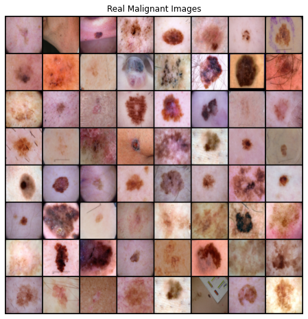
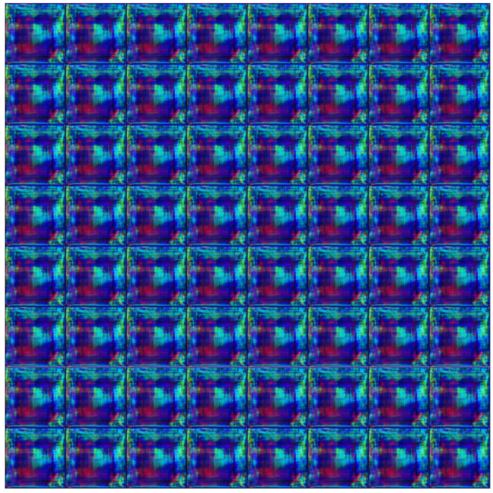
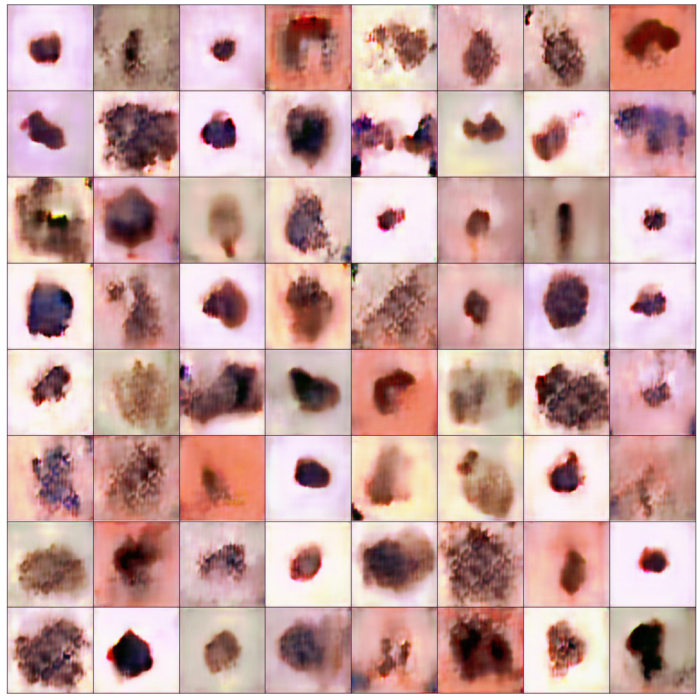
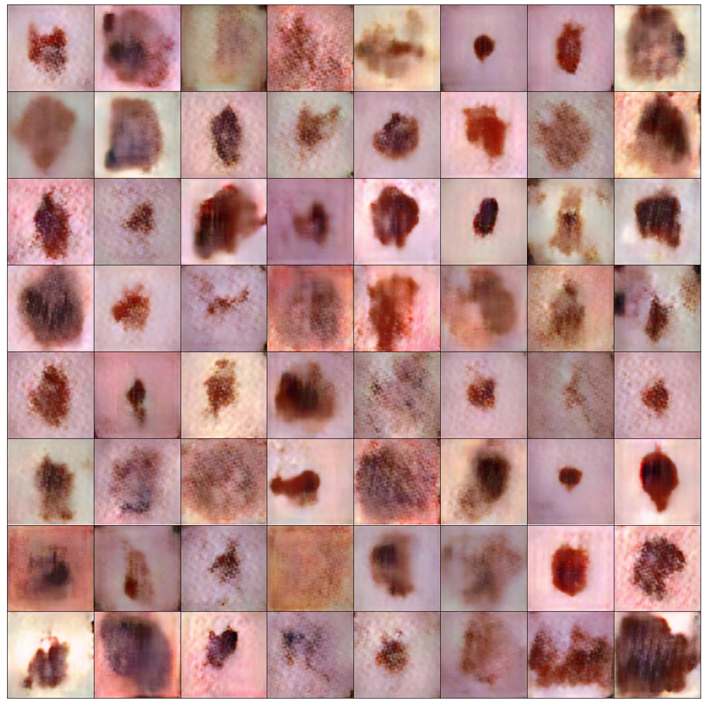
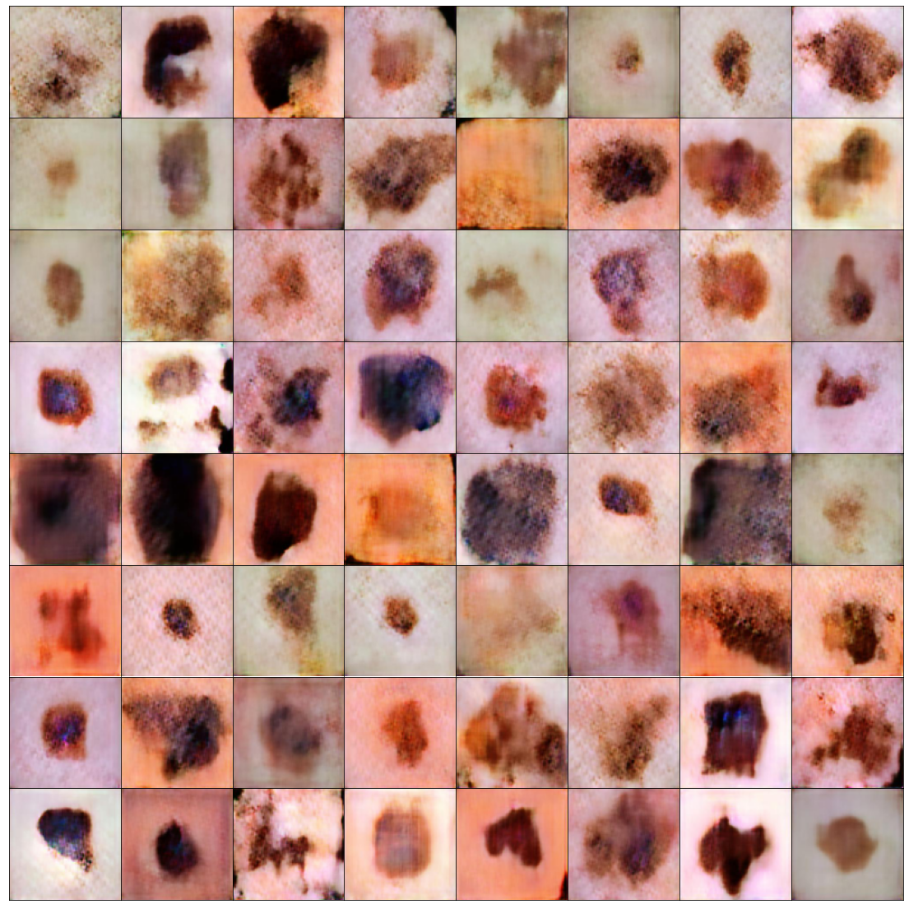
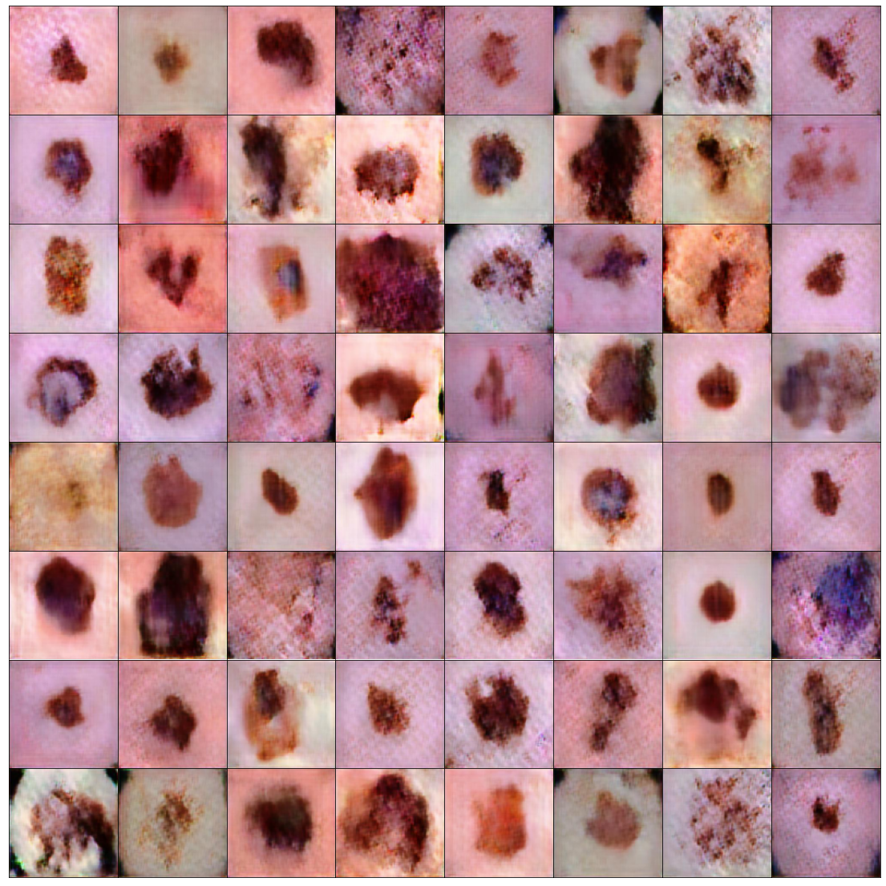
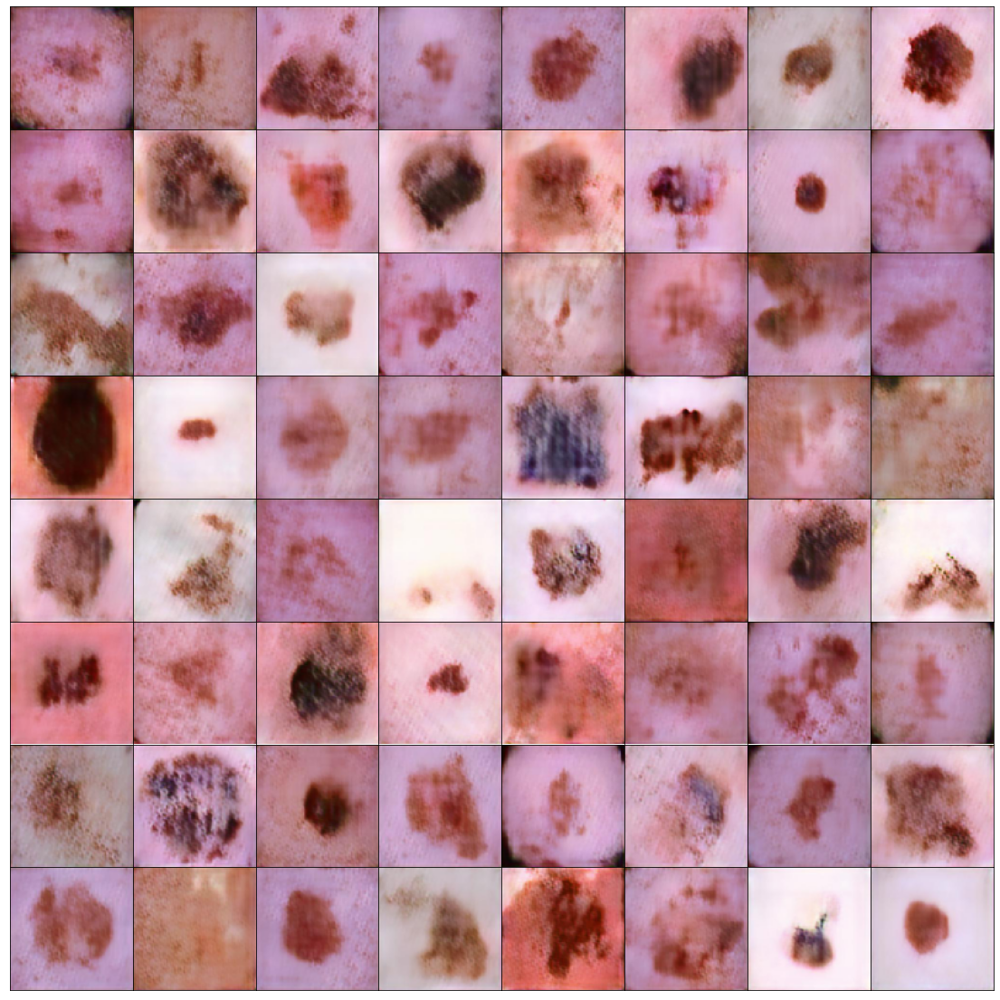

# Data Augmentation Using GANs to Improve Classification Performance

## Issue
- For 256x256, the network does not generate the image properly. (DCGAN Architecture)
- The higher the resolution, the easier it is for the discriminator to distinguish the image generated by the generator as fake.

## PGGAN
[Progressive Growing of GANs for Improved Quality, Stability, and Variation](https://arxiv.org/abs/1710.10196)

## Dataset

[Kaggle : Skin Cancer: Malignant vs. Benign](https://www.kaggle.com/fanconic/skin-cancer-malignant-vs-benign)

-	Skin Cancer dataset

> mage size: 224 x 224
Training data: Benign (1440장), Malignant(1197장)
Test data: Benign (360장), Malignant (300장)

## Problem
> 의료 분야의 특성 상 데이터 개방성이 낮고 절대적인 데이터의 수가 부족하다. 의료 데이터는 특유의 민감성 때문에 반드시 연구에 필요한 최소 수준의 데이터 요청 및 폐쇄된 환경에서만 활용이 가능해 데이터 접근이 매우 제한적이다. 양질의 데이터를 확보하는 데에도 한계가 있다. 질병의 특성 때문에 데이터 자체가 희귀하거나 데이터가 특정 그룹에 편향되어 있어 데이터 불균형 문제가 발생한다. 예시로 질병으로 분류(Classification)되는 데이터는 전체 데이터의 극히 일부만을 차지한다.
이러한 의료 데이터의 문제를 해결하기 위해 의료 데이터의 수를 늘리기에 적합한 Generative Adverarial Network (GAN)을 탐구하고, 합성 의료 데이터를 생성하여 Data Augmentation을 진행한다.
본 연구는 절대적으로 부족한 의료 데이터에 여러 GAN을 적용하여 Data Augmentation을 진행한다. 이를 통해 의료 데이터 분류(Classification) 모델의 성능을 향상 시키고자 한다. 더 나아가 의료 데이터와 같은 특성을 가진 유사 분야에 본 연구 방식을 적용하여 문제를 해결할 수 있다.

## GAN
음성종양인 malignant를 생성하였다.

> Lr: 0.001 Batch size: [32, 32, 32, 16, 16, 16, 16] epochs: 200

학습 장수
10 images

100 images

200 images

250 images

300 images

500 images

## Classification
|Model|10 images|100 images|200 images|250 images|300 images|500 images|All real|
|------|---|---|----|---|---|----|---|
|**Base (only Real)**|0.55 / 0.50|0.54 / 0.50|0.62 / 0.59|0.68 / 0.65|0.73 / 0.71|0.81 / 0.81|0.83 / 0.83|
|**PGGAN (w Fake)**|0.55 / 0.50|0.61 / 0.57|0.73 / 0.71|0.80 / 0.79|0.79 / 0.79|0.81 / 0.80|
|**PGGAN - Base**|0.00 / 0.00|0.07 / 0.05|0.11 / 0.12|0.12 / 0.14|0.06 / 0.08|0.00 / -0.01|

## Result
200 ~ 250 장의 종양 데이터만을 가지고 있는 경우에는 GAN이 성능을 10%정도 올려주는 것을 알 수 있다.

추후에는 Image Augmentation과 비교하였을 때 GAN augmenatation이 얼마나 성능이 더 좋은지 알아본다.