RelativisticGAN-Tensorflow
==========================

Simple Tensorflow implementation of [RelativisticGAN](https://arxiv.org/pdf/1807.00734.pdf)

Issue
-----

-	For 256x256, the network does not generate the image properly. (DCGAN Architecture)
-	As the epoch increases, the Generator Loss increases too much compared to the Discriminator Loss.
	-	I think the generator has fallen into the local minimum
	-	Concatenation of discriminator input with real image and fake image [256 x 256 x 6]
-	I think, `RaDRAGAN` more better than `RaLSGAN`

Usage
-----

### dataset

[Kaggle : Skin Cancer: Malignant vs. Benign](https://www.kaggle.com/fanconic/skin-cancer-malignant-vs-benign)

-	Skin Cancer dataset

```
├── dataset
   └── Benign
       ├── xxx.jpg
       └── ...
   └── Malignant
       ├── xxx.jpg
       └── ...    
```

-	or For `your dataset`, put images like this:

```
├── dataset
   └── YOUR_DATASET_NAME
       ├── xxx.jpg (name, format doesn't matter)
       ├── yyy.png
       └── ...
```

### train

-	python main.py --phase train --dataset benign --Ra True --gan_type dragan
-	python main.py --phase train --dataset malignant --Ra True --gan_type dragan

### test

-	python main.py --phase test --dataset benign --Ra True --gan_type dragan
-	python main.py --phase test --dataset malignant --Ra True --gan_type dragan
Summary
-------

***"the discriminator estimates the probability that the given real data is more realistic than a randomly sampled fake data"***

*= RGAN*

***"the discriminator estimates the probability that the given real data is more realistic than fake data, on average"***

*= RaGAN*

### Idea

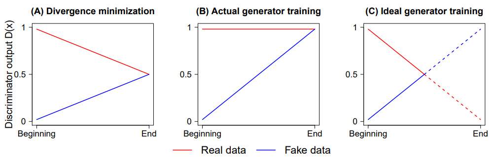

### Formulation

| *Name*         | *Formulation*                                                        |
|:--------------:|:--------------------------------------------------------------------:|
|    **GAN**     | 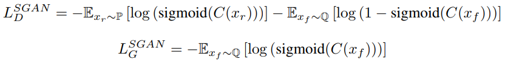 |
|    **RGAN**    |     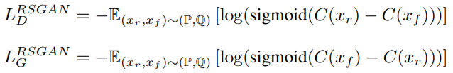     |
|   **RaGAN**    |    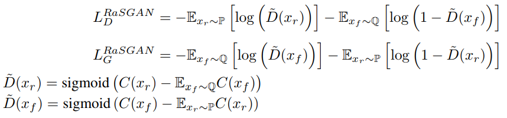    |
|  **RaGAN-GP**  |  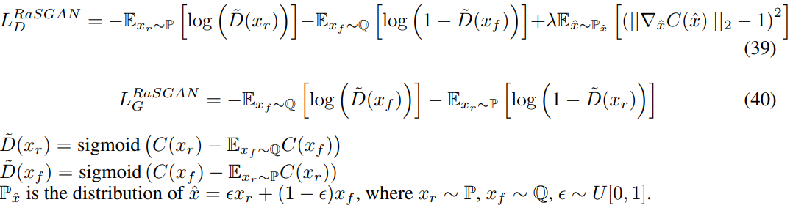   |
|  **RaLSGAN**   |   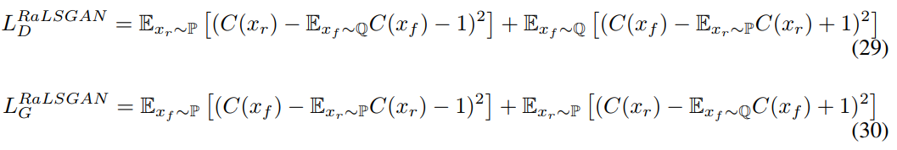   |
| **RaHingeGAN** | 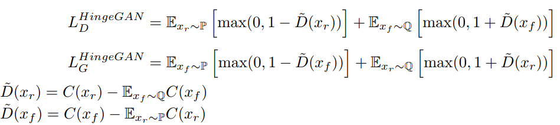  |

Results
-------

-	64 x 64 Benign, Malignant
-	100k iterations

### 64 x 64 DCGAN

**Benign** - images : 300 - Batch size : 32 - epoch : 400 - G loss : 8.5 - D loss : 0.2 - output size : 64 x 64

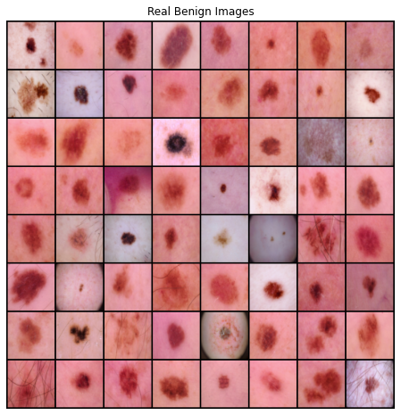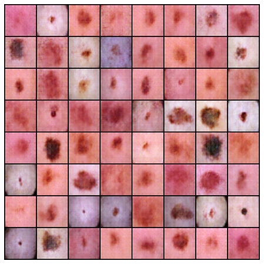

**malignant** 
- G loss : 7.13 
- D loss : 0.15

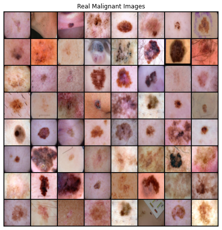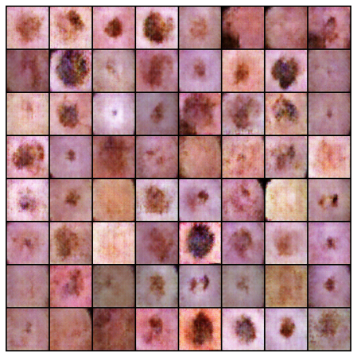

### 128 x 128

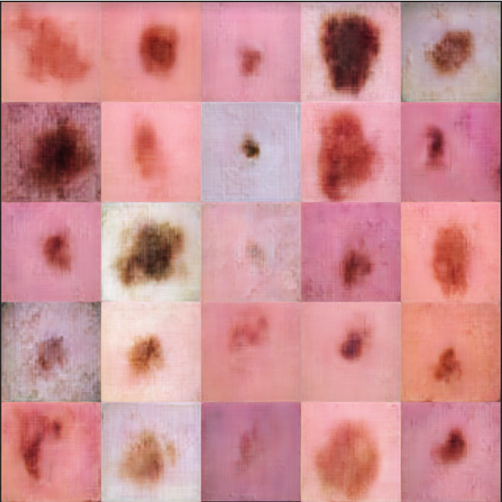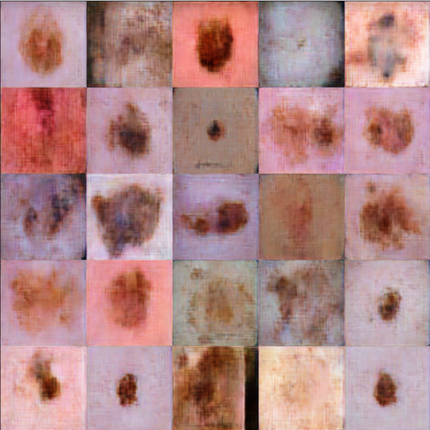

DCGAN 256 x 256 generation의 한계
---------------------------------

의료 사진은 분명 64 x 64처럼 저화질의 사진을 사용하지 않을텐데 그렇다면 GAN이 고화질을 생성해주어야 한다. - 연산량이 너무 많아 오래 걸림. - 계층이 너무 깊어 어디로 튈지 모른다. - 생성된다 해도 성능이 별로 좋지 않다.

RelativisticGAN with Mode Collapse 256 x 256
--------------------------------------------

**Benign** 
- Train : 1440 images 
- Batch size : 32 
- epoch : 5 (5000iter)
- G loss : 6.5 
- D loss : 0.1 
- output size : 256 x 256 

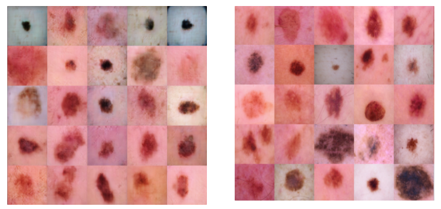

which is fake~?

**malignant**  
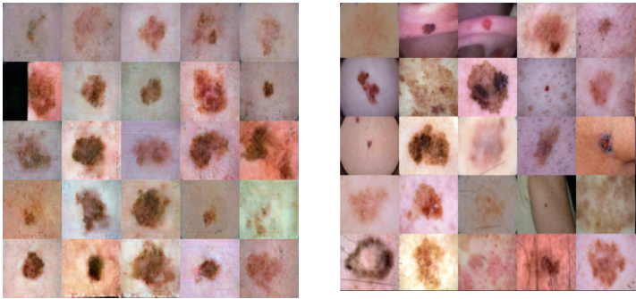

Reference
---------

[taki0112 : RelativisticGAN-Tensorflow](https://github.com/taki0112/RelativisticGAN-Tensorflow)
